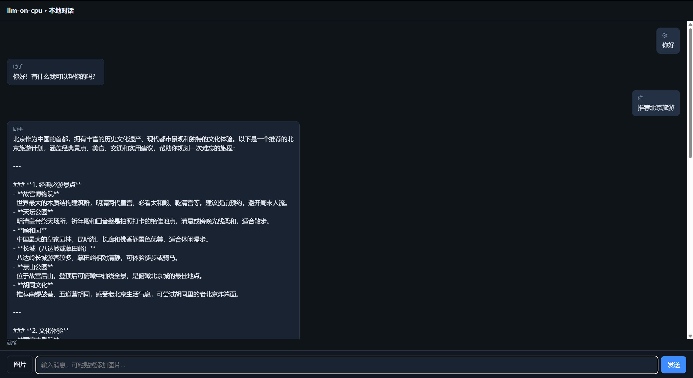
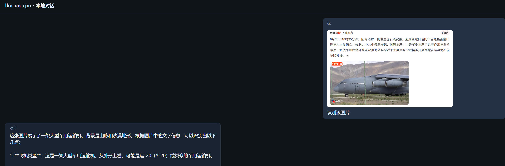

# llm-on-cpu

[中文](README.md) | [English](README.en.md)

**CPU LLM Inference** · **Sparse MoE** · **BF16 / INT4** · **Qwen3** · **OpenAI-Compatible API** · **AMX** · **Windows / Linux / macOS**

纯 CPU 大模型推理引擎 —— 在 64G 内存主机上，以 **BF16 不量化** 跑稀疏 MoE 大模型。  
**当前交付目标模型：Qwen3.8-27B**（BF16 全量 ~54-61G 恰好全常驻 64G DRAM，零缺页，  
预期原始 ~55 t/s、叠加 MTP 80+ t/s；详见 [docs/MODEL_QWEN3.8-27B.md](docs/MODEL_QWEN3.8-27B.md)）。  
同一引擎支持三种执行模式，**默认纯 CPU**，可选消费级显卡(8~24G)混合、或纯 GPU。  
DeepSeek-V4-Flash 保留为远期大模型场景（依赖 NVMe 流式，见架构文档）。

> 四阶段方案：[设计 DESIGN_P0_P3](docs/DESIGN_P0_P3.md) · [实现 IMPLEMENTATION_P0_P3](docs/IMPLEMENTATION_P0_P3.md)（**确认前不编码**）。

## 界面预览

本地对话页（`http://127.0.0.1:15085/`）：文本对话与图文多模态。

<p align="center">
  
</p>

<p align="center"><em>文本对话 · Markdown 渲染</em></p>

<p align="center">
  
</p>

<p align="center"><em>图片识别 · 多模态输入</em></p>

## 核心机制（为什么纯 CPU 能跑）

```
T_token = max( 计算时间, 总字节/DRAM带宽, 缺页字节/NVMe吞吐 )   ← 三项流水重叠取 max
有效速度 = 原始速度 × MTP接受倍数                                ← 带宽墙乘法器
```

| 机制 | 实现 |
|---|---|
| 专家级三级驻留（常驻/LRU热区/NVMe冷拉） | `weights/weight_manager` |
| gate 后下一层专家异步预取，双缓冲轮转 | `weights/prefetch_pipeline` |
| 热专家 pin 常驻（路由偏斜收益） | 同上 `Config.pinned` |
| MTP 自投机解码 verify 循环 | `model/spec_decode` |
| LWC 权重容器（专家粒度 4K 对齐直读） | `weights/lwc_format` |
| 异步 IO：线程池(三平台)/io_uring+O_DIRECT(Linux) | `weights/io_engine*` |
| AMX BF16 tile 微内核（SPR Linux） | `hal/amx_gemm` |

## 三平台支持（docs/PLATFORM.md 完整矩阵）

| | Windows | Linux | macOS |
|---|---|---|---|
| 角色 | 开发机 | **生产主目标**(SPR) | 逻辑层验证 |
| 状态 | ✅ 全链路已实证 | ✅ 代码就绪，CI 待实机 | 同源可编 |
| AMX/io_uring | 物理不可用→自动降级 | ✅ | 不适用 |

## 快速开始

### CI / 预编译包（GitHub Actions）

推送到 `main`/`master` 或开 PR 会自动编译 **Windows / Linux / macOS**，并上传应用包 + 源码包（Artifacts）。  
打 `v*` 标签会额外创建 GitHub Release，附件包括：

| 包 | 内容 |
|---|---|
| `llm-on-cpu-<ver>-windows-x64.zip` | `llmoc_server[.exe]` / `llmoc_server_int4` + configs |
| `llm-on-cpu-<ver>-linux-x64.zip` | 同上（含 liburing 构建） |
| `llm-on-cpu-<ver>-macos-arm64.zip` | 同上（逻辑验证向） |
| `llm-on-cpu-<ver>-src.zip` | 完整源码（不含 models/build） |

下载后解压，按包内 `RUN.txt` 启动；默认端口 **15085**。本地也可：`bash scripts/package_app.sh` / `bash scripts/package_source.sh`。

### Windows（开发机, MSVC 2022 BuildTools）

```powershell
cmd /c scripts\configure_dev.cmd   # CMake 配置(自动 vcvars + Ninja)
cmd /c scripts\build_dev.cmd       # 增量构建
.\build\msvc-x64\bin\llmoc_unit_tests.exe
```

### Linux（生产目标; 或容器）

```bash
./scripts/build_linux.sh                                  # 裸机(需 liburing-dev)
docker build -t llmoc-ci -f scripts/Dockerfile.ci . && docker run --rm llmoc-ci
```

### macOS

同 Linux 流程(clang)：`./scripts/build_linux.sh`（仅逻辑层验证定位）。

### 模型：放置与转换（一键）

```
models/<name>-hf/   ← HF 原始权重      models/<name>.lwc   ← 引擎只认这个
```

下载 / 转 LWC / 校验回填是三个底层工具（网络·布局重排·C++ 校验和），日常只需一条命令串起来：

```powershell
# 须已构建过一次(产出 lwc_verify); Windows: configure_dev + build_dev
node tools/prepare_model.mjs --model Qwen/Qwen3.8-27B
# 例: node tools/prepare_model.mjs --model Qwen/Qwen3.5-4B --prune-hf

# 新模型：下载→转换→校验→清掉 HF 大权重（留 config/tokenizer）
node tools/prepare_model.mjs --model Qwen/Qwen3.5-4B --prune-hf

# 只想清盘：
node tools/prepare_model.mjs --model Qwen/Qwen3.5-4B --skip-download --skip-convert --prune-hf
# bf16 → int4（Python / Node 等价；embedding 自动透传。大模型 Python 通常更快）
python tools/quantize_int4.py --src models/Qwen3.5-4B.lwc --out models/Qwen3.5-4B.int4.qlwc --method gptq
node tools/quantize_int4.mjs --src models/Qwen3.5-4B.lwc --out models/Qwen3.5-4B.int4.qlwc --method gptq
```

流水线：`download` → `convert` → `lwc_verify --update`（有 config 则交叉核对）→ 终检 → **可选清理 HF**。
- `--prune-hf`：校验通过后删 `*-hf` 内 `*.safetensors`（省约一半盘），保留 `config.json` / tokenizer  
- `--remove-hf`：删掉整个 `*-hf` 目录（更省盘）  
- 已下好权重：`--skip-download`；已转好只想清盘：`--skip-download --skip-convert --prune-hf`  

分步参数见 **[docs/USAGE.md](docs/USAGE.md)**。

### 转换完成后：启动 API 服务

```powershell
# 须已构建; 旁路保留 tokenizer.json + config.json（--prune-hf 即可，勿 --remove-hf）
cmd /c scripts\build_dev.cmd
.\build\msvc-x64\bin\llmoc_server.exe --config configs\engine.yaml
```

另开终端调用（CPU 参考实现，首 token 可能很慢；需约 10G+ 内存加载 4B BF16）：

浏览器打开对话页：`http://127.0.0.1:15085/`（效果见上方[界面预览](#界面预览)）。或用 API：

```powershell
# 健康检查
Invoke-RestMethod http://127.0.0.1:15085/healthz

# 非流式对话
Invoke-RestMethod http://127.0.0.1:15085/v1/chat/completions -Method Post -ContentType 'application/json' -Body '{"model":"default","messages":[{"role":"user","content":"你好"}],"max_tokens":64}'

# SSE 流式
curl.exe -N http://127.0.0.1:15085/v1/chat/completions -H "Content-Type: application/json" -d "{\"messages\":[{\"role\":\"user\",\"content\":\"hi\"}],\"stream\":true,\"max_tokens\":32}"

# Prometheus 指标
Invoke-WebRequest http://127.0.0.1:15085/metrics | Select-Object -Expand Content
```

可选认证：设置环境变量 `LLMOC_API_KEY`，请求带 `Authorization: Bearer ...`。配置见 [`configs/engine.yaml`](configs/engine.yaml)。

| 能力 | 状态 |
|---|---|
| 下载 / 转 LWC / 校验 / 清盘 | ✅ |
| OpenAI 兼容 `/v1/chat/completions`（非流式 + SSE） | ✅ `llmoc_server` |
| **INT4** BF16→QLWC 量化 + 推理 | ✅ `quantize_int4.py` / `.mjs` + `llmoc_server_int4`（独立路径） |
| **Qwen3.5 hybrid**（linear + full attn）CPU 对话 | ✅ 自动检测（无 LWC expert groups） |
| **MoE**（Qwen3.8 等）gate top-k + ExpertPrefetcher | ✅ 自动检测（有 expert groups） |
| `/healthz` · `/metrics` · radix · 调度队列 | ✅ |
| MTP 真接线 / 算子级 continuous batch | ⏳ |
| hybrid-gpu / pure-gpu | ✅ M5（`mode: hybrid_gpu`/`pure_gpu`/`auto`；需 cudart+cublas） |

`llmoc_server` 根据 `.lwc` 是否含专家组自动选择后端，无需改代码：

```yaml
# configs/engine.yaml — Qwen3.5-4B
model:
  path: models/Qwen3.5-4B.lwc

# MoE 示例（转好后改 path / tokenizer 旁路 *-hf）
# model:
#   path: models/qwen3827.lwc
```

完整说明：**[docs/USAGE.md](docs/USAGE.md)** · 模型预算：**[docs/MODEL_QWEN3.8-27B.md](docs/MODEL_QWEN3.8-27B.md)**

## 测试与基准

可执行文件均在构建产物目录（Windows: `.\build\msvc-x64\bin\`；Linux/macOS: `./build/release/bin/`）。

```powershell
$BIN = ".\build\msvc-x64\bin"   # Linux/macOS: BIN=./build/release/bin

# 单元测试
& "$BIN\llmoc_unit_tests.exe"

# API 服务
& "$BIN\llmoc_server.exe" --config configs\engine.yaml

# INT4 服务（先 quantize_int4.py / .mjs 生成 .qlwc；embedding 须透传）
& "$BIN\llmoc_server_int4.exe" --config configs\engine_int4.yaml

# INT4/BF16 GEMM 微基准（AVX2+OpenMP；估 decode 上界，非端到端 30tok/s）
& "$BIN\int4_gemm_bench.exe" --iters 30

# M0 平台画像: DRAM/NVMe 带宽 + ISA/FLOPS 探测
& "$BIN\m0_bandwidth.exe" --gb 2 --out hw_profile.json
& "$BIN\m0_isa.exe"

# M2 双缓冲预取流水线 A/B —— 支持合成模型或真实转换模型
& "$BIN\m2_pipeline_bench.exe" --layers 8 --experts 32 --part-mib 2 --topk 8
& "$BIN\m2_pipeline_bench.exe" --file models\v4flash.lwc --topk 8

# M3 投机解码乘法器表(α × k → tokens/step → 预测吞吐)
& "$BIN\m3_spec_table.exe" --base 51.67

# LWC 文件校验(转换后必跑)
& "$BIN\lwc_verify.exe" models\v4flash.lwc --update
& "$BIN\lwc_verify.exe" models\v4flash.lwc
```

### 已实测数字（开发机 i7-14650HX, 非 SPR 目标机）

| 项 | 数值 |
|---|---|
| M2 预取流水线加速 | **1.69x**（sync 30.5 → 51.7 tok/s, io_wait 160→76ms） |
| M3 乘法器预测 | α=0.7,k=3 → **2.53x** |
| DRAM / NVMe 直读 | 68 GB/s / 2339 MB/s |
| AMX | 硬件不具备(消费级 HX)，微内核在 SPR CI 上经 selftest 门禁验证 |
| INT4 GEMM (AVX2+OpenMP, M=9216×K=2560) | ~70 GFLOP/s（优化后；此前 ~13） |
| 本机端到端 decode（INT4 4B, 暖机） | 约数 tok/s；**30 tok/s 目标机是 SPR+AMX+MTP** |

## 目录结构

```
src/
├─ common/    平台抽象/日志/CPUID/对齐分配
├─ weights/   LWC格式 · IO引擎(线程池+io_uring) · 三级驻留 · 预取流水线
├─ model/     MTP 投机解码 · Qwen3.5 前向 · tokenizer · generate
├─ hal/       DeviceHAL + CpuOps(GEMM/attn/DeltaNet)
├─ sched/     请求队列 / mode-controller
├─ kv/        radix 前缀池(薄封装)
└─ server/    OpenAI 兼容 API / metrics → llmoc_server
tools/        convert_lwc · prepare_model · lwc_verify · m0/m2/m3 基准
tests/unit/   单测(含 tokenizer/config)
models/       权重目录(gitignore): <name>-hf/ 原始 + <name>.lwc 转换产物
docs/         ARCHITECTURE.md · IMPLEMENTATION.md · PLATFORM.md · USAGE.md
scripts/      Windows CMD / Linux sh / CI Dockerfile / 假模型生成
```

## 里程碑状态

| 里程碑 | 内容 | 状态 |
|---|---|---|
| M0 | 平台基线压测 + ISA 探测 | ✅ Windows 实测；AMX selftest 待 SPR |
| M1 | LWC + IO 引擎 + 三级驻留 | ✅ 线程池版；io_uring 已编入待 Linux 实测 |
| M2 | 双缓冲预取流水线 | ✅ **1.69x 实证** |
| M3 | MTP verify 状态机 | ✅ 14/14 单测；接权重=开放项 O2 |
| M4 | batching / API 服务化 | ✅ MVP：`llmoc_server` + chat + SSE + metrics |
| M5 | PlacementPlanner + 模式②③ + `hal/cuda_backend` | ✅ |

## 关键文档

- [docs/ARCHITECTURE.md](docs/ARCHITECTURE.md) — 架构设计（v0.4 冻结基线）
- [docs/IMPLEMENTATION.md](docs/IMPLEMENTATION.md) — 实现文档（语言选型/模块/测试方案）
- [docs/PLATFORM.md](docs/PLATFORM.md) — Windows/Linux/macOS 能力矩阵
- [docs/USAGE.md](docs/USAGE.md) — **使用说明**（模型放置/转换/验证/基准/能力边界）
